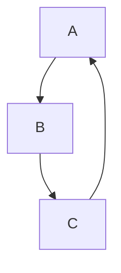
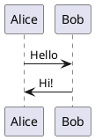

# HedgeDoc

HedgeDoc is the **real-time collaborative markdown editor** — paste your `.md` into a web editor, share the URL, coworkers join and type together with live cursors. Renders with a side-by-side preview, supports MathJax, Mermaid diagrams, PlantUML, flowcharts, sequence diagrams, slides, TOCs, code highlighting. The OSS successor to **HackMD** (still around as SaaS) and its earlier fork **CodiMD**.

Use cases:

- **Meeting notes** — everyone types at once, one shared doc
- **Retros + standups** — template + fill in
- **Technical docs** — auto-published markdown with diagrams
- **Slide presentations** — convert a note to reveal.js slides via frontmatter
- **Conferences / hackathons** — real-time collaborative notes
- **Study groups** — shared note-taking
- **Classroom** — teacher + students

Features:

- **Live collaboration** — multi-cursor, colored, with presence indicators
- **Markdown preview** — split view, source-only, or rendered-only
- **Code highlighting** — 200+ languages
- **Diagrams** — Mermaid, PlantUML, GraphViz, Vega, flowcharts, sequence diagrams, AbcJS music, chemistry (OpenSMILES), Fretboard, Geo (Leaflet maps)
- **Slides** — reveal.js via frontmatter `slideOptions`
- **Embed** — YouTube, Vimeo, gist, HackMD, CodePen, tweets, Slideshare
- **Permissions** — freely/editable/locked/private/protected
- **Auth** — Facebook/Twitter/GitHub/GitLab/Mattermost/Dropbox/Google/LDAP/SAML/OAuth2
- **Image upload** — local, imgur, S3, MinIO, Azure
- **Export** — HTML, PDF, slide PDF, markdown, book (multi-note bound together)
- **History** — revision history per note

- Upstream repo: <https://github.com/hedgedoc/hedgedoc>
- Website: <https://hedgedoc.org>
- Docs: <https://docs.hedgedoc.org>
- Demo: <https://demo.hedgedoc.org>
- Docker Hub: <https://hub.docker.com/r/linuxserver/hedgedoc>
- Official Docker: <https://quay.io/repository/hedgedoc/hedgedoc>
- Matrix: `#hedgedoc:matrix.org`
- Community forum: <https://community.hedgedoc.org>

## Architecture in one minute

- **Node.js** (Express) backend
- **Frontend**: CodeMirror editor + Markdown-it
- **DB**: SQLite (dev), MySQL/MariaDB/Postgres (prod)
- **Socket.IO**: real-time collaboration
- **Sessions** via cookies
- **Image storage**: local filesystem / imgur / S3 / MinIO / Azure
- **Stateless-ish**: except DB + `public/uploads/`

**Note: HedgeDoc 2.0 is a major rewrite** — breaking changes vs 1.x. Current stable is 1.x; 2.0 is under active development. Self-hosters should pin to 1.x for now unless tracking 2.0 alpha.

## Compatible install methods

| Infra          | Runtime                                              | Notes                                                                 |
| -------------- | ---------------------------------------------------- | --------------------------------------------------------------------- |
| Single VM      | **Docker Compose** (official or LinuxServer.io)         | **The way**                                                               |
| Single VM      | Native Node.js                                                 | Manual install; Node version-specific                                         |
| Cloudron       | Official app                                                     | One-click                                                                             |
| Heroku         | Officially supported (though free tier gone)                             | Possible                                                                                      |
| Kubernetes     | Community manifests / Helm                                                      | Works                                                                                                    |
| Raspberry Pi   | arm64 Docker                                                                           | Fine for small instances                                                                                            |

## Inputs to collect

| Input              | Example                         | Phase     | Notes                                                             |
| ------------------ | ------------------------------- | --------- | ----------------------------------------------------------------- |
| Domain             | `notes.example.com`                | URL       | Reverse proxy with TLS                                               |
| DB                 | Postgres/MySQL/MariaDB creds            | DB        | SQLite fine for dev / single-user                                             |
| Session secret     | random 64 chars                              | Crypto    | Don't rotate                                                                           |
| Upload backend     | local / imgur / S3 / MinIO / Azure                | Storage   | Local = persistent volume needed                                                                          |
| Auth providers     | Local email / OAuth / LDAP / SAML                      | Auth      | Choose one or many                                                                                              |
| Default permission | `freely` / `editable` / `limited` / `locked` / `protected` / `private` | Config    | New-note default                                                                                                            |
| Registration       | enable for public instances                                                       | Config    | Disable for private                                                                                                                       |

## Install via Docker Compose

```yaml
services:
  hedgedoc:
    image: quay.io/hedgedoc/hedgedoc:1.10      # pin specific 1.x version
    container_name: hedgedoc
    restart: unless-stopped
    depends_on: [db]
    environment:
      CMD_DB_URL: postgres://hedgedoc:<strong>@db:5432/hedgedoc
      CMD_DOMAIN: notes.example.com
      CMD_URL_ADDPORT: "false"
      CMD_PROTOCOL_USESSL: "true"
      CMD_ALLOW_ANONYMOUS: "true"           # allow anon "edit freely" notes
      CMD_ALLOW_FREEURL: "true"               # URL path = freely-chosen
      CMD_DEFAULT_PERMISSION: "editable"
      CMD_SESSION_SECRET: <random-64-chars>
      CMD_EMAIL: "true"                        # enable local email-password auth
      CMD_ALLOW_EMAIL_REGISTER: "false"       # lock down registration
      # Optional OAuth
      # CMD_GITHUB_CLIENTID: ...
      # CMD_GITHUB_CLIENTSECRET: ...
      # Upload backend
      # CMD_IMAGE_UPLOAD_TYPE: s3
      # CMD_S3_ACCESS_KEY_ID: ...
      # CMD_S3_SECRET_ACCESS_KEY: ...
      # CMD_S3_BUCKET: ...
    volumes:
      - ./uploads:/hedgedoc/public/uploads
    ports:
      - "3000:3000"

  db:
    image: postgres:16-alpine
    restart: unless-stopped
    environment:
      POSTGRES_USER: hedgedoc
      POSTGRES_PASSWORD: <strong>
      POSTGRES_DB: hedgedoc
    volumes:
      - hedgedoc-db:/var/lib/postgresql/data

volumes:
  hedgedoc-db:
```

Front with Caddy/Traefik for TLS.

## First boot

1. Browse `https://notes.example.com/`
2. Register / log in (or anon if `CMD_ALLOW_ANONYMOUS=true`)
3. "New Note" → write markdown → auto-saves; share URL
4. Permissions: click lock icon → set "editable" (anyone with URL can edit) / "locked" (only owner) / etc.
5. Diagrams: try a Mermaid diagram — `\`\`\`mermaid` fenced code block
6. Slides: add frontmatter `---\ntype: slide\n---` → presentation mode
7. Team pages: create team, invite members, notes within team scoped

## Markdown extras (in HedgeDoc)

````markdown
# Title

## Mermaid diagram



## PlantUML



## Math

$$
E = mc^2
$$

## Slide frontmatter

```yaml
---
type: slide
slideOptions:
  theme: black
  transition: slide
---
```

## TOC

[TOC]
````

## Data & config layout

- DB — all notes + users + permissions + history
- `public/uploads/` — locally-uploaded images (if `CMD_IMAGE_UPLOAD_TYPE=filesystem`)
- Config via env vars or `config.json`
- Session cookies — stateless beyond DB

## Backup

```sh
# DB (CRITICAL — every note)
docker exec hedgedoc-db pg_dump -U hedgedoc hedgedoc | gzip > hedgedoc-$(date +%F).sql.gz

# Uploads
tar czf hedgedoc-uploads-$(date +%F).tgz uploads/
```

## Upgrade

1. Releases: <https://github.com/hedgedoc/hedgedoc/releases>.
2. **HedgeDoc 2.0 will be a breaking rewrite.** 1.x → 2.x = not a simple bump; wait for stable 2.0 + migration tools.
3. Within 1.x: back up DB → bump tag → `docker compose up -d`. Migrations auto-run.
4. Read release notes for env variable renames.

## Gotchas

- **HedgeDoc 2.0 rewrite**: upstream is actively working on 2.0, a full rewrite. Stability is in **1.x**. Pin to 1.x tags (not `latest`, not `2.x-alpha`) for production. Watch release notes for the 2.0 stable + migration path.
- **HackMD vs CodiMD vs HedgeDoc naming history**: HackMD → forked to CodiMD → renamed to HedgeDoc. HackMD (hackmd.io) is the commercial SaaS still running; HedgeDoc is the OSS successor. Occasional confusion in old docs.
- **Anonymous notes** — if `CMD_ALLOW_ANONYMOUS=true` + `CMD_ALLOW_FREEURL=true`, anyone who hits `https://notes.example.com/anything` can create/edit a note there. Great for quick pasting, hazardous if public + unmoderated (spam, illegal content).
- **Note URLs are capabilities** — if you share the URL, whoever has it can edit (based on permission). Don't paste URLs publicly if the note is sensitive.
- **No full-text search across notes** out of the box. Add via DB indexes or external search.
- **History / versions** per-note is limited compared to Etherpad-style full replay. HedgeDoc stores snapshots on-save rather than every keystroke.
- **Export to PDF** uses headless Chromium if you add `CMD_ALLOW_PDF_EXPORT=true` + install Chromium (Docker image supports via env). Some setups break — simpler: export HTML + print-to-PDF in browser.
- **Image uploads fill disk** — for multi-user instances, move to S3/MinIO. Local-filesystem uploads can balloon.
- **Registration spam** — if you enable local email register + allow public signup, expect bot accounts. Lock down with OAuth-only or admin-approved signups.
- **Session secret**: set a stable one; rotating logs everyone out.
- **Behind reverse proxy**: set `CMD_PROTOCOL_USESSL=true`, `CMD_URL_ADDPORT=false`. Websocket pass-through is required for real-time collab — Caddy/Traefik do this automatically; Nginx needs explicit websocket upgrade config.
- **Mermaid + PlantUML + rendering upgrades** — diagrams rely on JS libs bundled in HedgeDoc; they upgrade with HedgeDoc version. Old syntax may break after a bump.
- **Presentation mode (slides)** — requires `type: slide` frontmatter; speaker notes via HTML comments work.
- **Auth migration** — from LDAP to OAuth or swapping providers can orphan accounts. Plan carefully.
- **Team feature is limited** in 1.x; 2.0 plans richer team/space model.
- **Scalability** — single Node process is fine for <100 concurrent editors. Beyond that, you need to plan sticky sessions + socket.io redis adapter.
- **License**: AGPL-3.0.
- **Alternatives worth knowing:**
  - **Etherpad** — real-time collaborative plain text / rich text (separate recipe)
  - **Outline** — team knowledge base; block-based; not markdown-first
  - **BookStack** — team docs; chapter/page model (separate recipe)
  - **Wiki.js** — flexible wiki with markdown + visual editor (separate recipe)
  - **Obsidian** (local) + **Obsidian LiveSync / Syncthing** — desktop-first; separate workflow (separate recipe for obsidian-livesync)
  - **Dendron / Logseq / Joplin / Standard Notes** — personal knowledge bases
  - **HackMD.io** — commercial HedgeDoc-equivalent
  - **Google Docs / Notion / Coda** — SaaS competitors
  - **CryptPad** — E2E collab office (separate recipe — batch 58)
  - **Choose HedgeDoc if:** you want real-time collab markdown with diagrams + slides + OSS.
  - **Choose Outline/BookStack/Wiki.js if:** you want structured team knowledge base, not freeform notes.
  - **Choose CryptPad if:** E2E encryption matters.
  - **Choose Etherpad if:** plain-text collab (non-markdown) is the use case.

## Links

- Repo: <https://github.com/hedgedoc/hedgedoc>
- Website: <https://hedgedoc.org>
- Docs: <https://docs.hedgedoc.org>
- Demo: <https://demo.hedgedoc.org>
- Docker setup: <https://docs.hedgedoc.org/setup/docker/>
- Manual setup: <https://docs.hedgedoc.org/setup/manual-setup/>
- Configuration reference: <https://docs.hedgedoc.org/configuration/>
- Releases: <https://github.com/hedgedoc/hedgedoc/releases>
- Matrix room: <https://matrix.to/#/#hedgedoc:matrix.org>
- Community forum: <https://community.hedgedoc.org>
- POEditor (translations): <https://poeditor.com/join/project/1OpGjF2Jir>
- HedgeDoc 2.0 dev docs: <https://docs.hedgedoc.dev>
- History of project: <https://hedgedoc.org/history>
- Docker Hub (LinuxServer.io): <https://hub.docker.com/r/linuxserver/hedgedoc>
